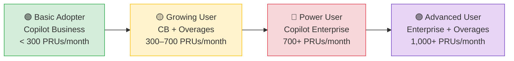
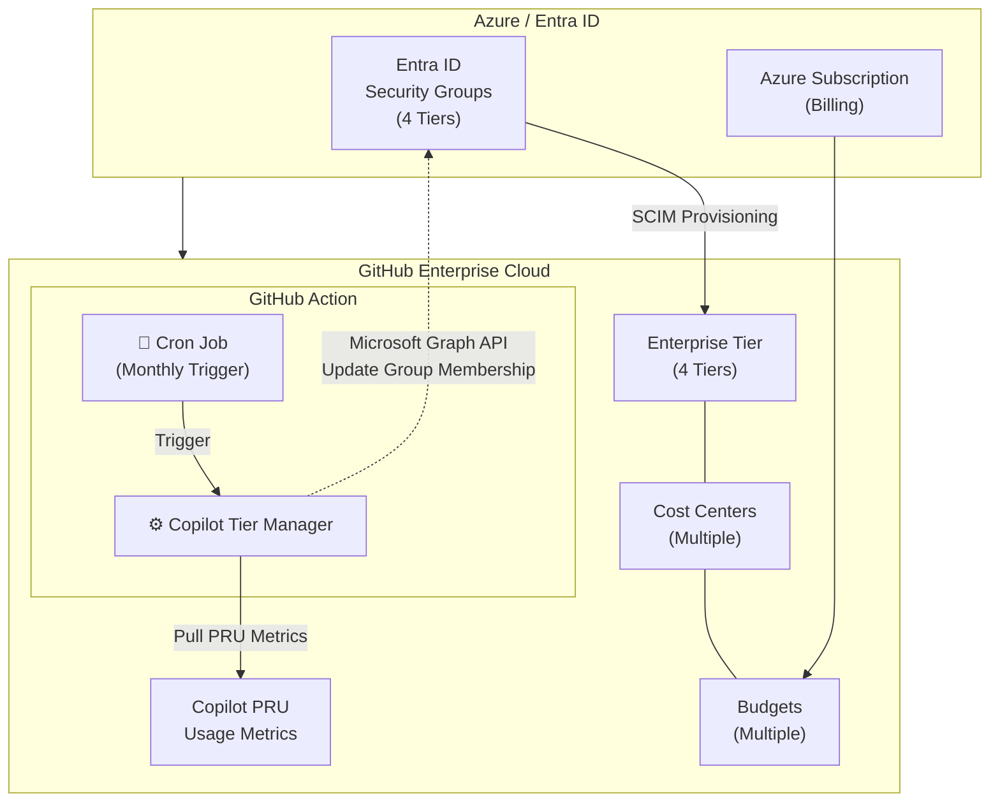

# Copilot Tier Manager

> Automatically classify GitHub Copilot users into tiers based on Premium Request usage and optimize license costs via Entra ID group management.

[](https://github.com/marketplace/actions/copilot-tier-manager)

---

## Why This Exists

- **GitHub Copilot Business** includes **300 PRUs/user/month**; **Enterprise** includes **1,000 PRUs/user/month**.
- Unused PRUs **don't roll over** — it's use-it-or-lose-it per user, per billing cycle.
- Organizations paying for Enterprise seats for low-usage users are overspending, while Business users exceeding their allowance generate costly overages.
- This action **automates moving users between tiers** based on actual PRU consumption so you only pay for what people use.

> **Stopgap solution.** GitHub's pooled billing model will make per-user PRU budgets obsolete. Until then, this automation bridges the gap.

---

## User Adoption Journey



---

## How It Works



1. **GitHub Action reads PRU usage** from the GitHub Enterprise API.
2. **Classifies each user** into a tier based on configurable thresholds.
3. **GitHub Action moves users between Entra ID security groups** via the Microsoft Graph API.
4. **SCIM provisioning syncs** group membership changes back to GitHub Enterprise Teams automatically.
5. **Copilot seats follow team membership** — users inherit the correct license plan.

---

## Quick Start

```yaml
- uses: ewega/copilot-tier-manager@v1
  with:
    enterprise: 'my-enterprise'
    dry_run: 'true'
  env:
    GITHUB_TOKEN: ${{ secrets.GH_ENTERPRISE_TOKEN }}
    AZURE_TENANT_ID: ${{ secrets.AZURE_TENANT_ID }}
    AZURE_CLIENT_ID: ${{ secrets.AZURE_CLIENT_ID }}
    AZURE_CLIENT_SECRET: ${{ secrets.AZURE_CLIENT_SECRET }}
```

---

## Inputs

| Name | Required | Default | Description |
|------|----------|---------|-------------|
| `enterprise` | **Yes** | — | GitHub Enterprise slug |
| `dry_run` | No | `"true"` | Preview changes without applying |
| `config_path` | No | `""` | Path to tiers YAML config. If empty, uses default thresholds with env vars for group IDs |
| `emu_suffix` | No | — | EMU username suffix (e.g. `_mycompany`) |
| `emu_domain` | No | — | Entra ID domain for UPN resolution |
| `emu_separator` | No | `"-"` | Character replaced with `.` for UPN mapping |
| `teams_webhook_url` | No | — | Microsoft Teams webhook URL for notifications |

## Outputs

| Name | Description |
|------|-------------|
| `summary` | Markdown summary of the sync run |
| `users_moved` | Number of users moved between tiers |
| `errors` | Number of errors encountered |

---

## Prerequisites

| Requirement | Details |
|-------------|---------|
| **GitHub Enterprise Cloud (EMU)** | Enterprise Managed Users org with Copilot enabled |
| **SCIM provisioning** | Configured between Microsoft Entra ID and the GitHub EMU Enterprise Application |
| **4 Entra ID security groups** | One per tier, assigned to the GitHub EMU Enterprise App in Entra ID |
| **4 GitHub Enterprise Teams** | Each linked to its Entra ID group via the SCIM `group_id` |
| **GitHub PAT** | Scopes: `read:enterprise`, `admin:enterprise`, `manage_billing:copilot` |
| **Azure App Registration** | API permissions (Application): `GroupMember.ReadWrite.All`, `User.Read.All`, `Group.ReadWrite.All` |

---

## Configuration

Tier thresholds and environment settings are defined in `config/tiers.yaml`:

```yaml
tiers:
  basic-adopter:
    min_pru: 0
    max_pru: 299
    entra_group_id: "<your-entra-group-id>"
    copilot_plan: "business"
    description: "New users / low adopters within included CB allowance"

  growing-user:
    min_pru: 300
    max_pru: 699
    entra_group_id: "<your-entra-group-id>"
    copilot_plan: "business"
    overage_enabled: true
    description: "Active users exceeding CB allowance, managed via overage budget"

  power-user:
    min_pru: 700
    max_pru: 999
    entra_group_id: "<your-entra-group-id>"
    copilot_plan: "enterprise"
    description: "High-usage users where CE is more cost-effective than CB+overages"

  advanced-user:
    min_pru: 1000
    max_pru: null          # unlimited
    entra_group_id: "<your-entra-group-id>"
    copilot_plan: "enterprise"
    overage_enabled: true
    description: "Power users on CE with overages for full AI-assisted development"

# Global settings
enterprise: "<your-enterprise-slug>"
azure_tenant_id: "<your-azure-tenant-id>"
emu_suffix: "<_your-enterprise>"
emu_domain: "<your-company.onmicrosoft.com>"
emu_username_separator: "-"
```

Users are classified by finding the highest tier whose `min_pru` threshold they meet or exceed.

---

## Full Workflow Example

Copy this to `.github/workflows/copilot-tier-sync.yml` in your repository:

```yaml
name: Copilot PRU Tier Sync

on:
  schedule:
    # Run monthly on the 2nd at 06:00 UTC (after PRU counters reset on the 1st)
    - cron: '0 6 2 * *'
  workflow_dispatch:
    inputs:
      dry_run:
        description: 'Preview changes only (no group modifications)'
        required: true
        default: 'true'
        type: choice
        options:
          - 'true'
          - 'false'

jobs:
  sync-copilot-tiers:
    runs-on: ubuntu-latest
    steps:
      - name: Sync Copilot user tiers
        uses: ewega/copilot-tier-manager@v1
        with:
          enterprise: 'your-enterprise-slug'
          dry_run: ${{ inputs.dry_run || 'true' }}
          emu_suffix: '_your-enterprise'
          emu_domain: 'your-company.onmicrosoft.com'
          teams_webhook_url: ${{ secrets.TEAMS_WEBHOOK_URL }}
        env:
          GITHUB_TOKEN: ${{ secrets.GH_ENTERPRISE_TOKEN }}
          AZURE_TENANT_ID: ${{ secrets.AZURE_TENANT_ID }}
          AZURE_CLIENT_ID: ${{ secrets.AZURE_CLIENT_ID }}
          AZURE_CLIENT_SECRET: ${{ secrets.AZURE_CLIENT_SECRET }}
```

---

## Local Development

```bash
pip install -r requirements.txt
python -m src.sync --enterprise my-enterprise --dry-run
```

## Testing

```bash
pytest tests/test_tier_engine.py -v
```

---

## License

MIT
